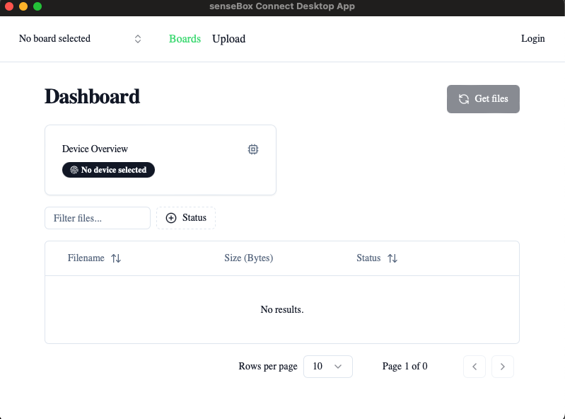

# Connect App Desktop

Mit der Connect app kann eine senseBox mit dem PC verbunden werden. Über das Tool können Daten verwaltet und hochgeladen werden!

## Starting the app in development

1. `npm install # yarn add`
2. `npm run tauri dev # yarn tauri dev`

## Building the app

` npm run build`

## Arduino

Lade den Arduino Sketch in `arduino-connect/connect` auf eine senseBox. Danach:

- Wähle Board im Dropdown aus (alle Seriellen Monitoren von Arduion o.ä. vorher schließen)
- Drücke 'Get Files'
- Alle `.csv` Dateien auf der SD-Karte können ausgelesen und runtergeladen werden.
